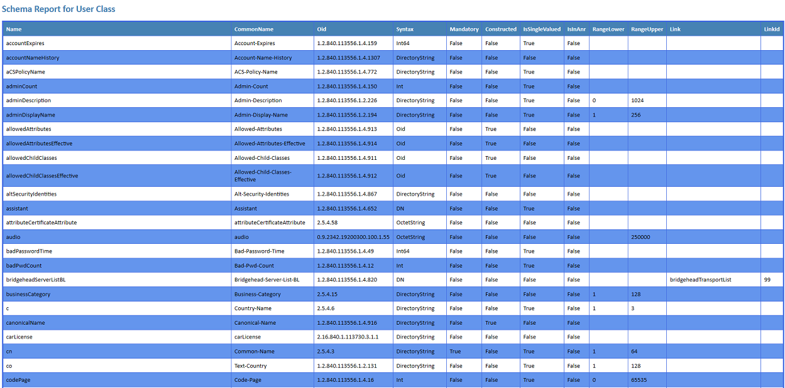

# Simple Schema Reporter
A simple Active Directory schema reporting script in Windows PowerShell.

The idea behind this script is to allow visibilty of the attributes of different classes in Active
Directory that might not be easily visible via the standard management tools.

The Simple Schema Reporter is designed to connect to the schema of the current ADDS forest
and report on the attributes of the class(es) specified by the ClassName parameter.

There is no requirement for the Active Directory cmdlets to be present on the machine running this
script as .Net is used directly.

Reports are available as HTML, XML or CSV files or can be output directly onto the Clipboard as an HTML table.

An option is available to immediately view the report(s) generated using the ViewOutput parameter.

The HTMLFile output contains a JavaScript function to sort the results of the table by any column heading.
Please be aware the the performance of the sorting script is poor, so please bear with it whilst it sorts.
Many of the schema entries have ~400 properties!
